<div align="center">

# 🧠 MockMind AI

### **AI-Powered Full-Stack Mock Interview Platform**

> A full-stack AI interview preparation platform that simulates a structured multi-round hiring journey — from intelligent resume screening and proctored technical assessments to conversational AI interviews and personalized performance analytics.

<br />

`React 19` &nbsp;•&nbsp; `FastAPI` &nbsp;•&nbsp; `MongoDB` &nbsp;•&nbsp; `Ollama` &nbsp;•&nbsp; `Qwen3:4b` &nbsp;•&nbsp; `MediaPipe Tasks Vision` &nbsp;•&nbsp; `Web Speech API`

<br />

</div>

---

## 🧭 Explore MockMind AI

- [🚀 How MockMind AI Works](#-how-mockmind-ai-works)
- [🔄 The Complete Interview Journey](#-the-complete-interview-journey)
- [📄 Round 1 — Intelligent Resume Screening](#-round-1--intelligent-resume-screening)
- [⏱️ Round 2 — Online Assessment](#️-round-2--online-assessment)
- [🧠 Assessment Intelligence](#-assessment-intelligence)
- [🎯 AI Interview Setup](#-ai-interview-setup)
- [🎙️ Round 3 — Conversational AI Interview](#️-round-3--conversational-ai-interview)
- [🤖 AI Architecture](#-ai-architecture)
- [🏗️ System Architecture](#️-system-architecture)
- [🔌 Frontend → API → Backend](#-frontend--api--backend)
- [🔗 Interview Data Flow](#-interview-data-flow)
- [🗄️ Data Layer](#️-data-layer)
- [🔐 Interview Integrity & Proctoring](#-interview-integrity--proctoring)
- [📊 Performance Intelligence](#-performance-intelligence)
- [🛠️ Technology Stack](#️-technology-stack)
- [📂 Project Structure](#-project-structure)
- [🌐 Application Route Map](#-application-route-map)
- [⚙️ Environment Configuration](#️-environment-configuration)
- [🧠 Local AI Runtime](#-local-ai-runtime)
- [🚀 Installation & Setup](#-installation--setup)
- [👨‍💻 Typical User Journey](#-typical-user-journey)
- [💡 Why MockMind AI?](#-why-mockmind-ai)
- [📋 Product Capabilities Matrix](#-product-capabilities-matrix)
- [🔭 Future Roadmap](#-future-roadmap)
- [👨‍💻 Author](#-author)

---

## 🚀 How MockMind AI Works

MockMind AI transforms scattered interview prep into a structured, realistic enterprise-style hiring pipeline:

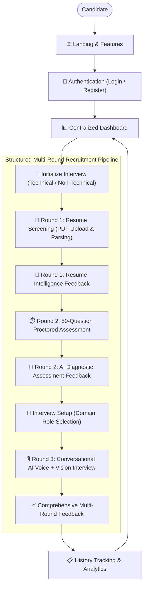

---

## 🔄 The Complete Interview Journey

Each stage of the interview builds upon the candidate's previous submissions to generate contextual questions and comprehensive evaluations:

```mermaid
graph TD
    A["Public Landing Page<br/><code>/</code>, <code>/features</code>, <code>/how-it-works</code>"] --> B["Authentication<br/><code>/login</code>, <code>/register</code>"]
    B --> C["Candidate Dashboard<br/><code>/dashboard</code>"]
    C --> D["Start New Interview<br/><code>Select Track: Technical / Non-Technical</code>"]
    
    D --> E["Round 1 — Resume Screening<br/><code>/round1</code><br/>• Drag-and-Drop PDF Upload (≤ 5MB)<br/>• PyMuPDF Text Extraction"]
    E --> F["Round 1 — Resume Intelligence<br/><code>/round1-feedback</code><br/>• ATS Compatibility Analysis<br/>• Skill & Role-Fit Evaluation (Qwen3:4b)"]
    
    F --> G["Round 2 — Online Assessment<br/><code>/test</code><br/>• 50 MCQs (10 Aptitude + 10 Reasoning + 30 Domain)<br/>• 50-Minute Timed Countdown<br/>• Real-Time Proctoring & Security Safeguards"]
    G --> H["Round 2 — Diagnostic Intelligence<br/>• Strengths & Weakness Mapping<br/>• Category Performance Scoring"]
    
    H --> I["AI Interview Setup<br/><code>/setup</code><br/>• Target Role & Domain Selection<br/>• Dynamic Pipeline Initialization"]
    I --> J["Round 3 — AI Interview<br/><code>/ai-interview</code><br/>• Voice Readiness Gate<br/>• Speech-to-Text Answers & AI Vocal TTS<br/>• MediaPipe FaceLandmarker Vision Tracking"]
    
    J --> K["Final Combined Feedback<br/><code>/feedback</code><br/>• Multi-Round Weighted Scoring<br/>• Actionable Growth Recommendations"]
    K --> L["History & Analytics<br/><code>/history</code>, <code>/dashboard</code>"]
```

---

## 📄 Round 1 — Intelligent Resume Screening

Round 1 provides automated resume parsing and ATS (Applicant Tracking System) intelligence using local LLM inference and deterministic keyword extractors.

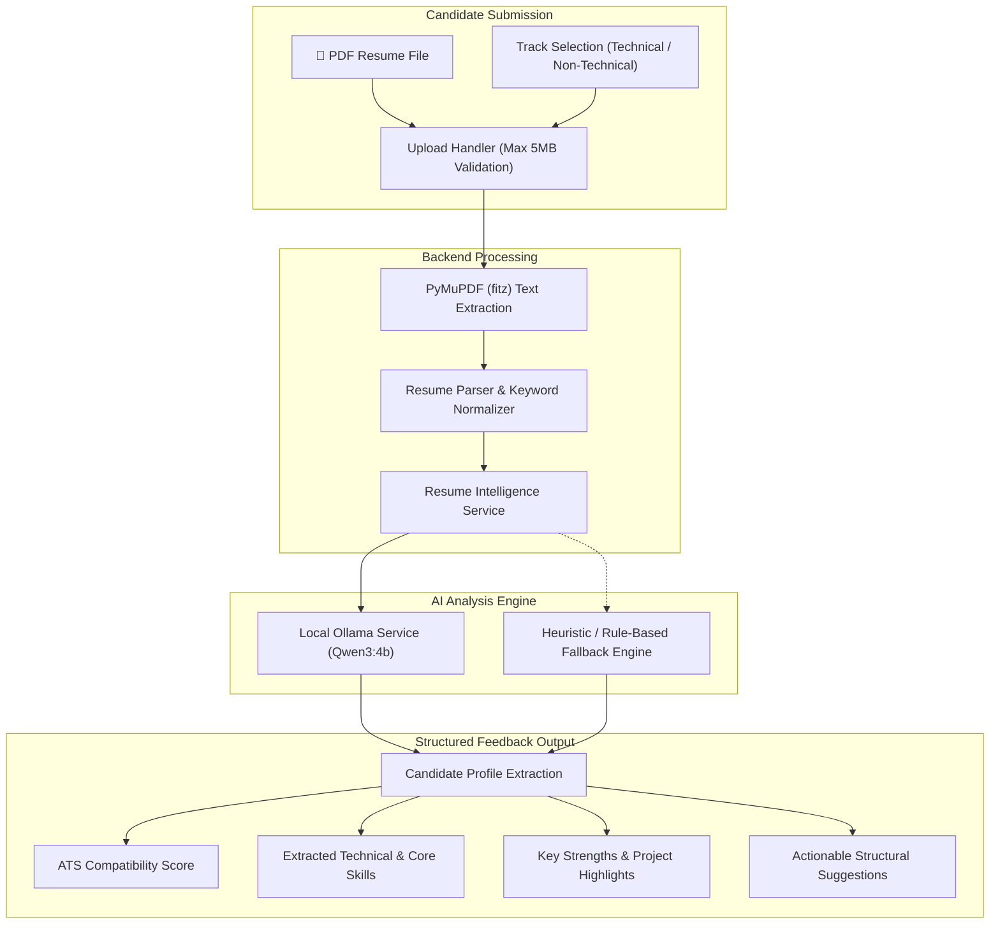

### Key Capabilities Confirmed in Source:
- **Strict PDF Ingestion**: Client and server-side validation enforcing PDF format and a 5MB size limit.
- **PyMuPDF Extraction**: Clean text extraction without relying on external cloud document parsers.
- **Ollama `qwen3:4b` Intelligence**: Deep parsing for role-fit assessment, experience summaries, and skill detection.
- **Resilient Fallback**: If local LLM inference is offline or busy, rule-based heuristics ensure the candidate's journey is never blocked.
- **Immediate Feedback Loop**: Dedicated `/round1-feedback` route presenting resume strengths and areas of improvement before moving forward.

---

## ⏱️ Round 2 — Online Assessment

Round 2 tests foundational competencies through a 50-question, 50-minute timed screening examination.

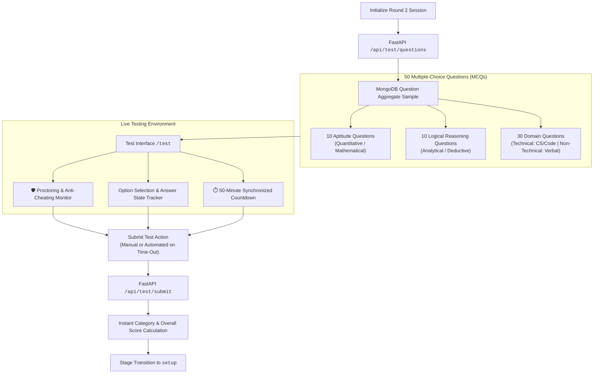

---

## 🧠 Assessment Intelligence

Performance in Round 2 is evaluated across categories to provide diagnostic insights:

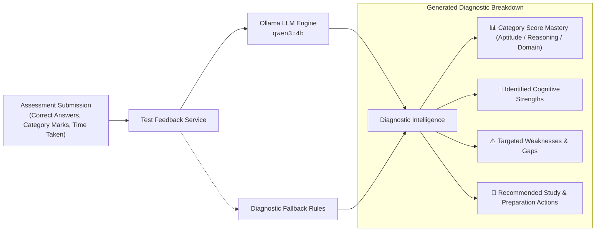

---

## 🎯 AI Interview Setup

Between the written assessment and live interview, candidates configure their target role domain on `/setup`:

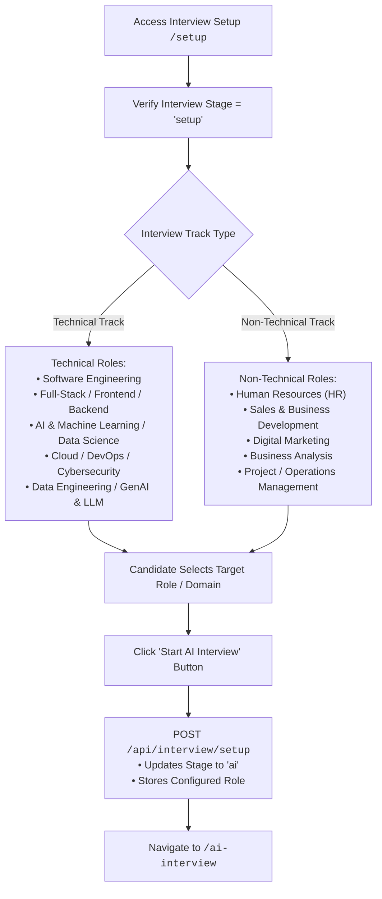

---

## 🎙️ Round 3 — Conversational AI Interview

Round 3 represents the core simulation: an interactive video and voice interview with real-time browser-based computer vision and conversational turn-taking.

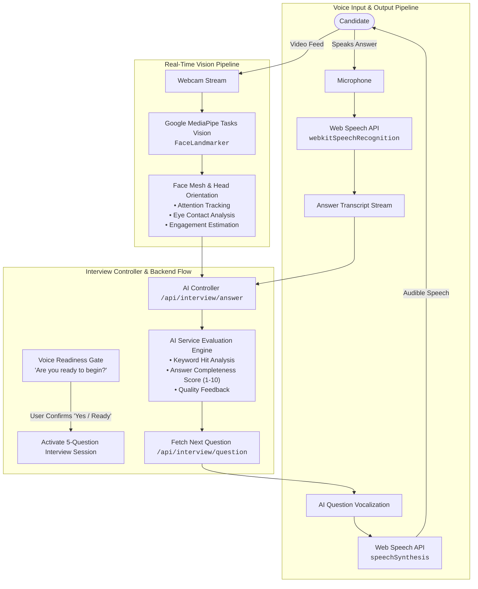

### Browser AI Technologies Confirmed in Code:
1. **Web Speech API (`webkitSpeechRecognition`)**: Converts spoken answers into real-time text without requiring paid cloud transcription APIs.
2. **Speech Synthesis (`speechSynthesis`)**: Gives MockMind AI a spoken voice to read questions and deliver audio guidance.
3. **Google MediaPipe Tasks Vision (`@mediapipe/tasks-vision`)**: Client-side FaceLandmarker computer vision running on WebAssembly/WebGL to track engagement and head pose locally on the candidate's device.
4. **Conversational Readiness Gate**: Candidates confirm their readiness verbally ("Yes", "I'm ready", "Let's start") before question timers and evaluation commence.

---

## 🤖 AI Architecture

MockMind AI integrates local language models, browser APIs, and edge computer vision into a cohesive multi-modal intelligence system:

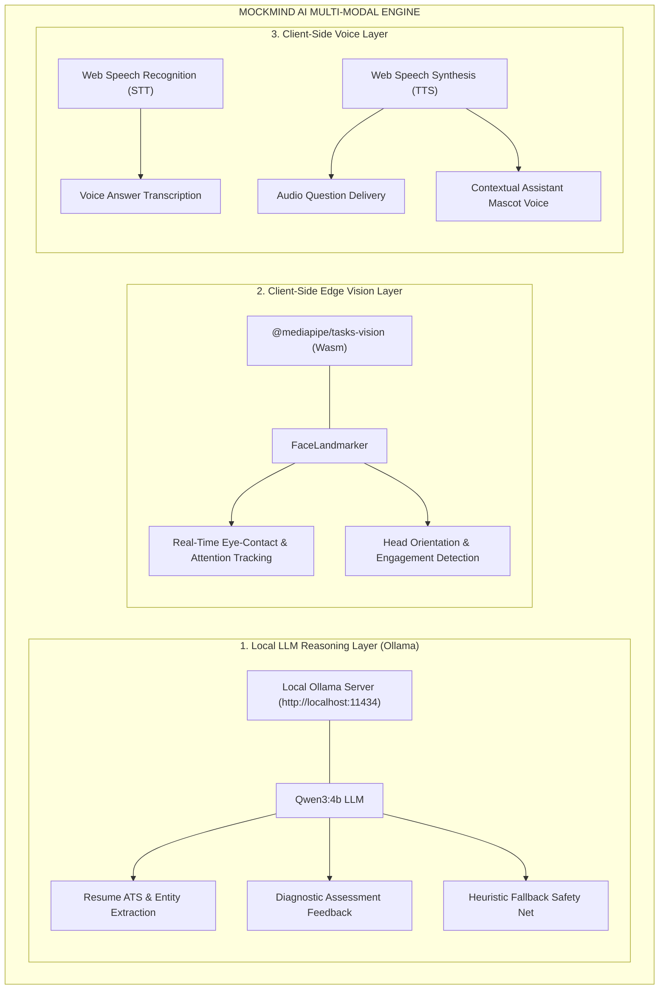

---

## 🏗️ System Architecture

Complete architectural blueprint illustrating the connection between the user's browser, the FastAPI backend, MongoDB, and local AI engines:

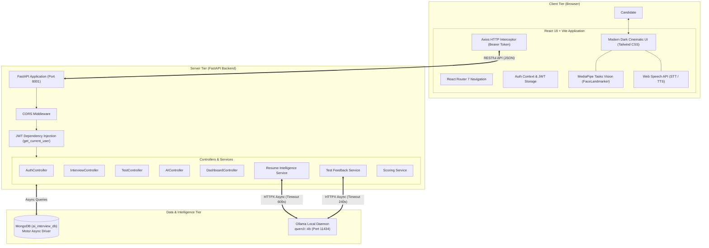

---

## 🔌 Frontend → API → Backend

Communication between the frontend client and backend services is handled via cleanly namespaced REST APIs:

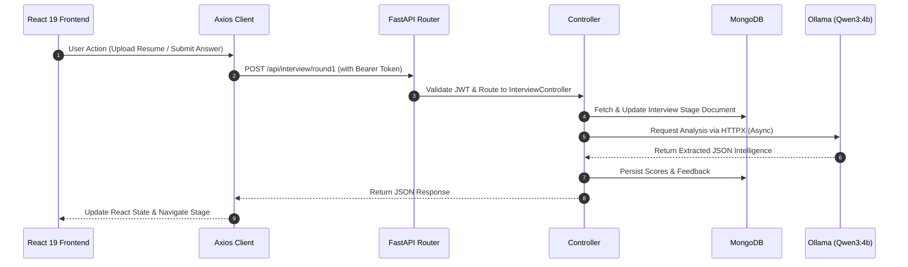

### API Endpoint Reference

#### 🔐 Authentication (`/api/auth`)
| Method | Endpoint | Purpose |
| :--- | :--- | :--- |
| `POST` | `/api/auth/register` | Register new user account |
| `POST` | `/api/auth/login` | Authenticate user credentials and return JWT bearer token |
| `PUT` | `/api/auth/profile` | Update candidate profile attributes |
| `POST` | `/api/auth/change-password` | Update existing user password |

#### 🎤 Interview Lifecycle (`/api/interview`)
| Method | Endpoint | Purpose |
| :--- | :--- | :--- |
| `POST` | `/api/interview/start` | Initialize new interview session (`technical` or `non-technical`) |
| `POST` | `/api/interview/round1` | Upload PDF resume for parsing and ATS scoring |
| `POST` | `/api/interview/setup` | Set target domain role for Round 3 |
| `GET` | `/api/interview/result` | Retrieve full interview results across all rounds |
| `GET` | `/api/interview/stage` | Validate current interview pipeline stage |
| `GET` | `/api/interview/history` | Fetch user interview history |

#### 🧪 Online Assessment (`/api/test`)
| Method | Endpoint | Purpose |
| :--- | :--- | :--- |
| `GET` | `/api/test/questions` | Retrieve 50 randomized MCQs (10 Aptitude, 10 Reasoning, 30 Domain) |
| `POST` | `/api/test/submit` | Submit test answers for automated evaluation |

#### 🤖 AI Interview Interaction (`/api/interview`)
| Method | Endpoint | Purpose |
| :--- | :--- | :--- |
| `POST` | `/api/interview/readiness` | Evaluate candidate verbal readiness response |
| `POST` | `/api/interview/question` | Fetch next tailored AI interview question |
| `POST` | `/api/interview/answer` | Submit spoken answer transcript for AI scoring |
| `POST` | `/api/interview/skip` | Skip the current active interview question |

#### 📊 Dashboard Analytics (`/api/dashboard`)
| Method | Endpoint | Purpose |
| :--- | :--- | :--- |
| `GET` | `/api/dashboard/overview` | Global candidate overview metrics (Total, Average, Best, Recent) |
| `GET` | `/api/dashboard/analytics` | Track-filtered performance analytics (`technical` vs `non-technical`) |
| `GET` | `/api/dashboard/history` | Full candidate interview log |

---

## 🔗 Interview Data Flow

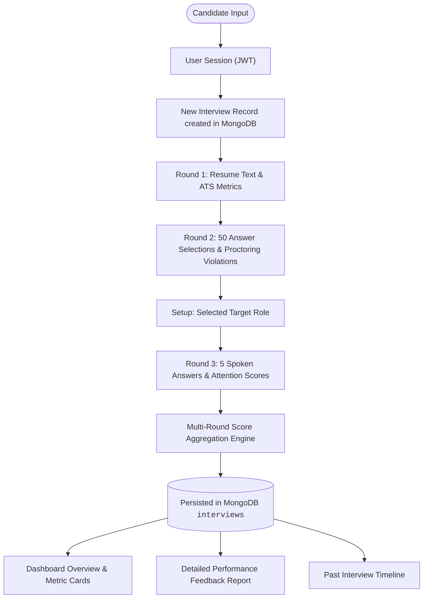

---

## 🗄️ Data Layer

MockMind AI utilizes an asynchronous **MongoDB** document database via the **Motor** driver. The database stores structured records across verified collections:

| Collection | Role in Platform | Confirmed Fields & Schemas |
| :--- | :--- | :--- |
| `users` | User credentials & accounts | `username`, `email`, `hashed_password`, `name`, `created_at` |
| `interviews` | Master state of each interview session | `user_id`, `interview_type`, `stage`, `resume_data`, `test_questions`, `test_score`, `round3_state`, `scores`, `overall_score` |
| `aptitude_questions` | Aptitude MCQ question bank | `question`, `options`, `correct_answer`, `category: "aptitude"` |
| `reasoning_questions`| Logical reasoning question bank | `question`, `options`, `correct_answer`, `category: "reasoning"` |
| `tests` | Technical domain question bank | `question`, `options`, `correct_answer`, `category: "technical"` |
| `verbal_questions` | Non-technical verbal question bank | `question`, `options`, `correct_answer`, `category: "verbal"` |

---

## 🔐 Interview Integrity & Proctoring

The Round 2 Online Assessment is protected by automated proctoring safeguards implemented directly within `Test.jsx`:

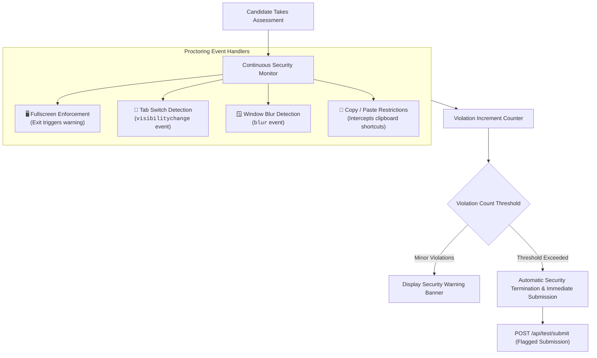

---

## 📊 Performance Intelligence

The candidate dashboard aggregates multi-round performance metrics to provide continuous insights into progress:

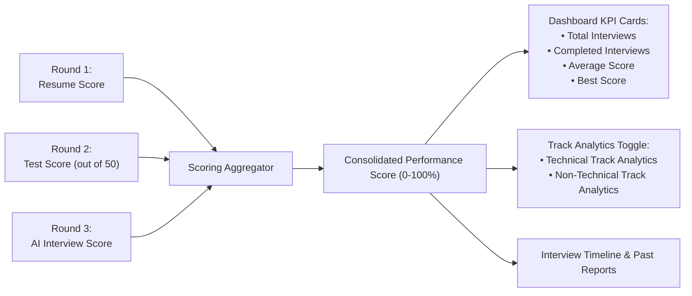

---

## 🛠️ Technology Stack

### Frontend
| Technology | Version | Purpose |
| :--- | :--- | :--- |
| **React** | `19.2.4` | Component architecture & modern UI rendering |
| **Vite** | `8.0.4` | Development server & lightning-fast production bundler |
| **React Router** | `7.14.0` | Client-side routing with protected layout wrappers |
| **Tailwind CSS** | `3.4.19` | Cinematic dark UI styling with warm peach accents |
| **MediaPipe Tasks Vision** | `1.0.1` | Real-time face tracking & eye contact analysis |
| **Lucide React** | `1.8.0` | Consistent iconography across all pages |
| **Axios** | `1.15.0` | Promise-based HTTP client with authorization headers |
| **Web Speech API** | Native Browser API | Client-side Speech Recognition (STT) and Synthesis (TTS) |

### Backend
| Technology | Version | Purpose |
| :--- | :--- | :--- |
| **FastAPI** | Current | High-performance asynchronous REST API framework |
| **Uvicorn** | Standard | Lightning-fast ASGI production web server |
| **Motor** | Current | Asynchronous Python driver for MongoDB |
| **PyMuPDF (`fitz`)** | Current | PDF text extraction and document preprocessing |
| **HTTPX** | Current | Asynchronous HTTP client for local Ollama communication |
| **Pydantic** | v2 / email | Schema definition, input validation, and settings |
| **Python-Jose** | Cryptography | JWT encoding, decoding, and bearer token handling |
| **Passlib** | Bcrypt | Secure, one-way password hashing and verification |

### Local AI & Storage
| Technology | Details | Purpose |
| :--- | :--- | :--- |
| **Ollama** | Local runtime (`:11434`) | Zero-cost, private, offline LLM execution |
| **Qwen3:4b** | Model | Structured resume parsing and test diagnostic feedback |
| **MongoDB** | Database (`:27017`) | NoSQL document storage for users, interviews, and question banks |

---

## 📂 Project Structure

```text
Ai_Interview/
├── backend/
│   ├── app/
│   │   ├── controllers/            # Request handlers and business orchestration
│   │   │   ├── ai_controller.py
│   │   │   ├── auth_controller.py
│   │   │   ├── dashboard_controller.py
│   │   │   ├── interview_controller.py
│   │   │   └── test_controller.py
│   │   ├── core/                   # Security, JWT tokens, and settings
│   │   ├── db/                     # MongoDB connection life-cycle handlers
│   │   ├── dependencies/           # Database session and auth dependencies
│   │   ├── exceptions/             # Global error handlers
│   │   ├── middleware/             # Custom authentication middleware
│   │   ├── models/                 # Internal data models
│   │   ├── routes/                 # FastAPI API route declarations
│   │   │   ├── ai_routes.py
│   │   │   ├── auth_routes.py
│   │   │   ├── dashboard_routes.py
│   │   │   ├── interview_routes.py
│   │   │   └── test_routes.py
│   │   ├── schemas/                # Pydantic request and response schemas
│   │   ├── services/               # Deep logic (AI, resume parsing, scoring)
│   │   │   ├── ai_service.py
│   │   │   ├── dashboard_service.py
│   │   │   ├── resume_intelligence_service.py
│   │   │   ├── resume_service.py
│   │   │   ├── scoring_service.py
│   │   │   └── test_feedback_service.py
│   │   └── utils/                  # Text normalizers and helpers
│   ├── main.py                     # Backend application entry point
│   ├── requirements.txt            # Python dependencies
│   └── .env.example                # Sample environment configuration
│
├── frontend/
│   ├── src/
│   │   ├── assets/                 # Brand assets and visual imagery
│   │   ├── components/
│   │   │   ├── ai/                 # Avatar logic and speech synthesis
│   │   │   ├── dashboard/          # Layouts, navigation bars, and headers
│   │   │   └── landing/            # Landing page navigation and footer
│   │   ├── context/                # AuthContext and state management
│   │   ├── pages/
│   │   │   ├── auth/               # Login and Register pages
│   │   │   ├── dashboard/          # Dashboard metrics and analytics
│   │   │   ├── history/            # Interview history log
│   │   │   ├── interview/          # Staged interview pipeline:
│   │   │   │   ├── Round1.jsx          # Resume screening
│   │   │   │   ├── Round1Feedback.jsx  # Resume intelligence feedback
│   │   │   │   ├── Test.jsx            # 50-question online assessment
│   │   │   │   ├── Setup.jsx           # Domain and role configuration
│   │   │   │   ├── AIInterview.jsx     # Live AI voice and vision interview
│   │   │   │   └── Feedback.jsx        # Final combined performance review
│   │   │   ├── landing/            # Home, Features, How It Works, Why MockMind
│   │   │   └── profile/            # User profile management
│   │   ├── services/               # Axios API instance
│   │   ├── App.jsx                 # Master application routing
│   │   ├── index.css               # Design system, variables, and typography
│   │   └── main.jsx                # React DOM entry point
│   ├── package.json                # Frontend dependencies and npm scripts
│   ├── tailwind.config.js          # Tailwind CSS theme configuration
│   └── vite.config.js              # Vite configuration
│
└── README.md                       # Root documentation
```

---

## 🌐 Application Route Map

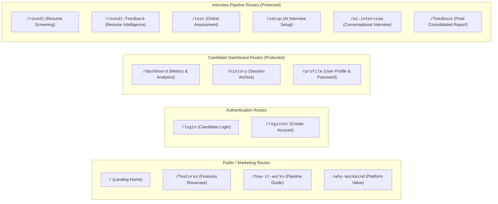

---

## ⚙️ Environment Configuration

Configure the backend environment by creating a `.env` file in the `backend/` directory based on `backend/.env.example`:

```env
MONGO_URI=mongodb://localhost:27017/
DATABASE_NAME=ai_interview_db
SECRET_KEY=your_super_secret_jwt_key_please_change
ACCESS_TOKEN_EXPIRE_MINUTES=1440
```

---

## 🧠 Local AI Runtime

MockMind AI runs its language model locally using **Ollama**, ensuring complete candidate data privacy, zero API subscription costs, and offline capability:

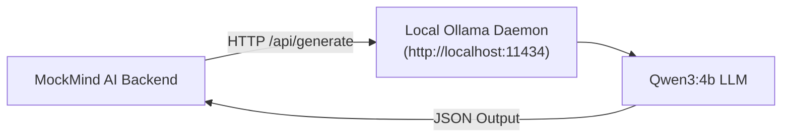

### Starting the Local Model:
```bash
# 1. Install Ollama from https://ollama.com
# 2. Pull the configured Qwen model:
ollama pull qwen3:4b

# 3. Ensure the daemon is running (default port 11434):
ollama serve
```

*Note: The platform features automated fallback heuristics. If Ollama is temporarily offline or processing on low-spec hardware, the system transitions smoothly to rule-based evaluation without disrupting the candidate's interview.*

---

## 🚀 Installation & Setup

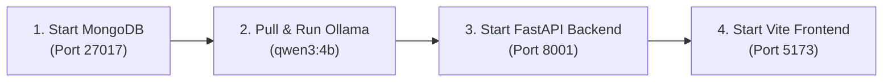

### 1. Prerequisites
- **Node.js** (v18+) & `npm`
- **Python** (v3.10+)
- **MongoDB** running on `localhost:27017`
- **Ollama** with `qwen3:4b` installed

### 2. Backend Setup
```bash
# Navigate to the backend directory
cd backend

# Create and activate a Python virtual environment
python -m venv venv

# Windows:
venv\Scripts\activate
# macOS / Linux:
# source venv/bin/activate

# Install Python requirements
pip install -r requirements.txt

# Start the FastAPI server
python -m uvicorn app.main:app --reload --port 8001
```
Interactive API documentation will be available at: `http://127.0.0.1:8001/docs`

### 3. Frontend Setup
```bash
# In a separate terminal, navigate to the frontend directory
cd frontend

# Install Node dependencies
npm install

# Start the Vite development server
npm run dev
```
Access the application in your browser at: `http://localhost:5173`

---

## 👨‍💻 Typical User Journey

1. **Discovery & Sign-Up**: The candidate explores platform features on the landing page, creates an account, and logs in.
2. **Dashboard Overview**: The candidate reviews their previous scores and selects **Start Interview** (choosing either the *Technical* or *Non-Technical* track).
3. **Resume Submission**: In Round 1, the candidate uploads their PDF resume. The system validates the file, extracts text via PyMuPDF, and computes an ATS score.
4. **Resume Intelligence**: The candidate inspects detected skills, strengths, and formatting recommendations on `/round1-feedback`.
5. **Timed Assessment**: In Round 2, the candidate enters fullscreen to complete 50 MCQs across Aptitude, Reasoning, and Domain competencies within 50 minutes under active proctoring.
6. **Role Configuration**: On `/setup`, the candidate picks their specific target role from the curated domain catalog.
7. **Conversational AI Practice**: In Round 3, the candidate activates camera and microphone, verifies readiness verbally, and answers 5 AI-vocalized questions while MediaPipe assesses engagement.
8. **Holistic Feedback**: The candidate reviews an actionable report combining scores across all three rounds with specific improvement guidance.

---

## 💡 Why MockMind AI?

Traditional interview tools suffer from major limitations: simple chatbots only prompt generic questions without context, while online tests lack conversational depth. 

**MockMind AI combines the entire recruitment pipeline into one integrated preparation ecosystem:**

- **Comprehensive End-to-End Journey**: Integrates resume screening, cognitive/domain testing, and conversational practice.
- **Privacy-First Local AI**: Operates on a local LLM via Ollama (`qwen3:4b`)—keeping candidate resumes and responses private with zero third-party API costs.
- **Multi-Modal Interaction**: Incorporates Web Speech API (STT & TTS) alongside Google MediaPipe vision for real-time engagement analysis.
- **Enterprise-Grade Proctoring**: Simulates realistic exam conditions with fullscreen, blur, and tab-switch monitoring.
- **Actionable Growth Intelligence**: Delivers diagnostic feedback after every stage, helping candidates identify exact areas to study before real interviews.

---

## 📋 Product Capabilities Matrix

| Module | Core Functionality | Confirmed Implementation Technologies |
| :--- | :--- | :--- |
| **Authentication** | Secure JWT authentication & profile updates | FastAPI, `python-jose`, `passlib[bcrypt]` |
| **Resume Screening** | PDF parsing, ATS scoring & keyword extraction | PyMuPDF (`fitz`), Ollama `qwen3:4b`, FastAPI |
| **Online Assessment** | 50 MCQs (Aptitude, Reasoning, Domain) | MongoDB Aggregation, React 19, FastAPI |
| **Proctoring Engine** | Fullscreen, tab visibility & clipboard control | React DOM event listeners (`visibilitychange`, `blur`) |
| **Assessment Intelligence**| Automated grading & diagnostic feedback | Test Feedback Service, Ollama `qwen3:4b` |
| **Voice Interaction** | Speech-to-text answers & audio question delivery | Web Speech API (`SpeechRecognition`, `speechSynthesis`) |
| **Vision Tracking** | Head pose, attention & eye contact estimation | Google MediaPipe Tasks Vision (`@mediapipe/tasks-vision`) |
| **Analytics Dashboard** | Track toggles, KPI cards & performance history | React 19, Axios, Motor (MongoDB) |

---

## 🔭 Future Roadmap

### ✅ Currently Implemented & Verified
- [x] Full multi-round recruitment pipeline (Round 1 → Round 2 → Setup → Round 3 → Feedback).
- [x] Local private LLM intelligence (`qwen3:4b` via Ollama) with fallback heuristic handlers.
- [x] PyMuPDF resume parsing and automated ATS evaluation.
- [x] 50-question proctored online assessment with 50-minute countdown.
- [x] Browser-based proctoring safeguards (tab switch, window blur, clipboard locks).
- [x] Live video preview with MediaPipe FaceLandmarker attention tracking.
- [x] Hands-free conversational speech recognition and vocalized speech synthesis.
- [x] Interactive voice mascot assistant delivering situational advice across the application.
- [x] Comprehensive multi-round scoring and performance dashboard analytics.

### 🚀 Future Enhancements (Planned)
- [ ] **Candidate Video Replay Analysis**: Session recording playback with timestamped feedback markers.
- [ ] **Voice Emotion & Pitch Diagnostics**: Vocal acoustic analysis for confidence, pace, and pause tracking.
- [ ] **In-Browser Coding Sandbox**: Interactive code editor with test-case execution for software engineering candidates.
- [ ] **Company-Specific Practice Packs**: Question catalogs modeled after specific corporate recruitment tracks.
- [ ] **Multilingual Interview Simulation**: Multi-language translation support for international interview preparation.

---

## 👨‍💻 Author

<div align="center">

### **Sujan Pradhan**
**CSE-AI Student**  
MockMind AI Project Lead

</div>
